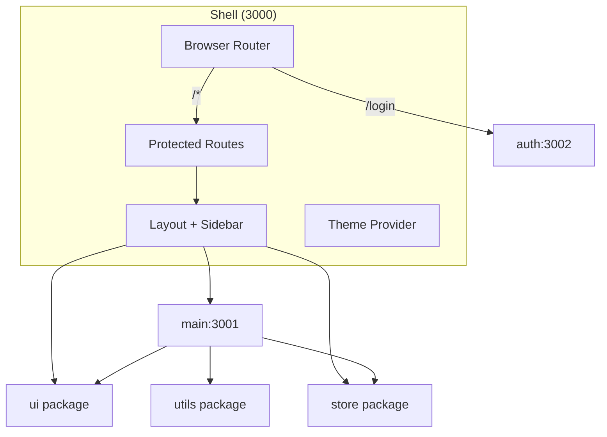

# CRM - Enterprise Customer Relationship Management

Microfrontend monorepo built with **Vite Module Federation** (`@originjs/vite-plugin-federation`).

## Architecture

```
crm/
├── apps/
│   ├── shell/          Host application (orchestrates all MFEs)
│   ├── main/           Main CRM app - Dashboard, Accounts, Contacts, etc.
│   │   └── src/
│   │       ├── pages/         Page components (Accounts.tsx, Contacts.tsx, etc.)
│   │       └── components/    Page-specific components grouped by feature
│   │           ├── Accounts/modals/
│   │           ├── Contacts/modals/
│   │           └── Opportunities/modals/
│   └── auth/           Authentication - Login page (protected)
├── packages/
│   ├── ui/             Shared UI components (Button, Card, Sidebar, Charts, Forms)
│   ├── store/          Zustand global state (theme, sidebar, notifications)
│   └── utils/          Shared hooks (useDebounce, useLocalStorage) & formatters
└── docs/               Architecture & deployment documentation
```

### Microfrontend Structure



## Quick Start

```bash
# Install dependencies
pnpm install

# Start development (3 terminals)
# Terminal 1: Build remotes with watch mode
pnpm dev:remotes

# Terminal 2: Serve built remotes
pnpm serve:remotes

# Terminal 3: Shell with HMR
pnpm dev:shell
```

Or run individually:
```bash
pnpm --filter @crm/shell run dev
pnpm --filter @crm/main run dev    # watch build
pnpm --filter @crm/main run serve  # preview
```

## Modules

| App | Port | Routes | Description |
|-----|------|--------|-------------|
| `@crm/shell` | 3000 | `/*` | Host - serves all routes, handles auth |
| `@crm/main` | 3001 | `/dashboard`, `/accounts`, `/contacts`, `/opportunities`, `/pipeline`, `/quotes`, `/tasks`, `/reports`, `/settings`, `/directory` | Main CRM app |
| `@crm/auth` | 3002 | `/login` | Login page (protected) |

## Authentication

**Private access only** - No public registration.

### Login Credentials
- **Email:** `admin@crm.com`
- **Password:** `crm123`

The auth system:
- Validates credentials on login
- Stores auth state in localStorage
- Protects all routes except `/login`
- Redirects unauthorized users to login

## Shared Packages

| Package | Purpose | Exports |
|---------|---------|---------|
| `@crm/ui` | UI Components | Button, Card, Badge, Input, Sidebar, Header, Charts, FormInput, FormSelect, Tabs, `cn()` |
| `@crm/utils` | Hooks & Utils | useLocalStorage, useDebounce, useFetch, formatDate, formatCurrency |
| `@crm/store` | State Management | useStore - theme, sidebar, notifications |

## Build

```bash
# Build all apps and packages
pnpm build

# Output in apps/*/dist
```

## Deployment

### Recommended: Sub-path Routing

Deploy all apps under single domain:

```
crm.company.com/          -> Shell
crm.company.com/login    -> Auth
crm.company.com/dashboard -> Main
```

### Nginx Config

See [docs/deployment/nginx-simple.conf](./docs/deployment/nginx-simple.conf) for simple nginx setup without Docker.

```bash
# Build
pnpm build

# Copy dist folders to server
scp -r apps/shell/dist user@server:/var/www/crm-shell/
scp -r apps/main/dist user@server:/var/www/crm-main/
scp -r apps/auth/dist user@server:/var/www/crm-auth/

# Copy nginx config and reload
```

## Documentation

- [Microfrontend Architecture](./docs/microfrontend-architecture.md) - Architecture overview
- [Deployment Strategy](./docs/deployment-strategy.md) - Deployment options comparison
- [Nginx Config](./docs/deployment/nginx-simple.conf) - Simple nginx deployment
