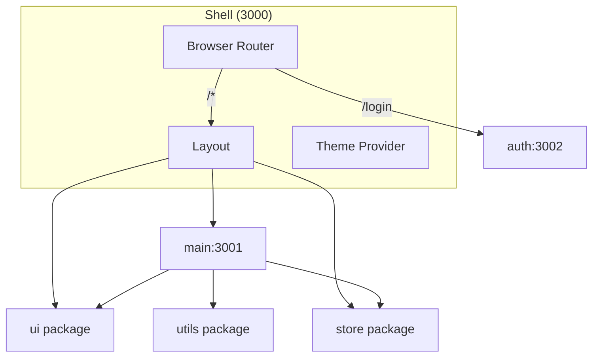

# CRM - Enterprise Customer Relationship Management

Microfrontend monorepo built with **Vite Module Federation** (`@originjs/vite-plugin-federation`).

## Architecture

```
crm/
├── apps/
│   ├── shell/          Host application (orchestrates all MFEs)
│   ├── main/           Main CRM app - Dashboard, Accounts, Contacts, etc.
│   └── auth/           Authentication - Login page
├── packages/
│   ├── ui/             Shared UI components (Button, Card, Sidebar, Charts)
│   ├── store/          Zustand global state (theme, sidebar, notifications)
│   └── utils/          Shared hooks (useDebounce, useLocalStorage) & formatters
└── docs/               Architecture & deployment documentation
```

### Microfrontend Structure



## Quick Start

```bash
# Install dependencies
pnpm install

# Start development (3 terminals)
# Terminal 1: Build remotes with watch mode
pnpm dev:remotes

# Terminal 2: Serve built remotes
pnpm serve:remotes

# Terminal 3: Shell with HMR
pnpm dev:shell
```

Or run individually:
```bash
pnpm --filter @crm/shell run dev
pnpm --filter @crm/main run dev    # watch build
pnpm --filter @crm/main run serve  # preview
```

## Modules

| App | Port | Routes |
|-----|------|--------|
| `@crm/shell` | 3000 | Host - serves all routes |
| `@crm/main` | 3001 | `/dashboard`, `/accounts`, `/contacts`, `/opportunities`, `/pipeline`, `/quotes`, `/tasks`, `/reports`, `/settings`, `/directory` |
| `@crm/auth` | 3002 | `/login` |

## Shared Packages

| Package | Purpose | Exports |
|---------|---------|---------|
| `@crm/ui` | UI Components | Button, Card, Badge, Input, Sidebar, Header, Charts, `cn()` |
| `@crm/utils` | Hooks & Utils | useLocalStorage, useDebounce, useFetch, formatDate, formatCurrency |
| `@crm/store` | State Management | useStore - theme, sidebar, notifications |

## Adding a New Module

```bash
# Scaffold new feature module (manual setup required)
mkdir apps/new-feature
cd apps/new-feature
pnpm create vite . --template react-ts
```

Then update `mfe.config.json` to register the new module.

## Build

```bash
# Build all apps and packages
pnpm build
```

## Deployment

See [docs/deployment-strategy.md](./docs/deployment-strategy.md) for deployment options.

**Recommended**: Sub-path routing on single domain (`crm.company.com/*`)

## Documentation

- [Microfrontend Architecture](./docs/microfrontend-architecture.md) - Architecture overview and design decisions
- [Deployment Strategy](./docs/deployment-strategy.md) - Deployment options comparison
- [Deployment Process](./docs/deployment_process/) - Step-by-step deployment guides:
  - [01 - Why Sub-paths](./docs/deployment_process/01-why-subpaths.md)
  - [02 - Vite Configuration](./docs/deployment_process/02-vite-configuration.md)
  - [03 - Unified Build](./docs/deployment_process/03-unified-build.md)
  - [04 - Server Routing](./docs/deployment_process/04-server-routing.md)
