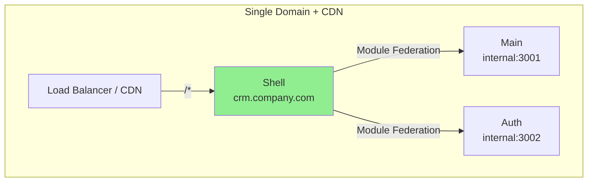
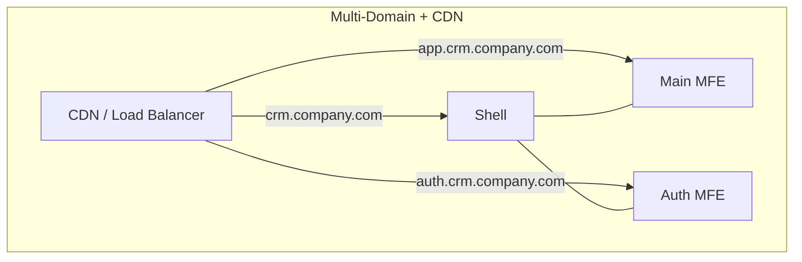
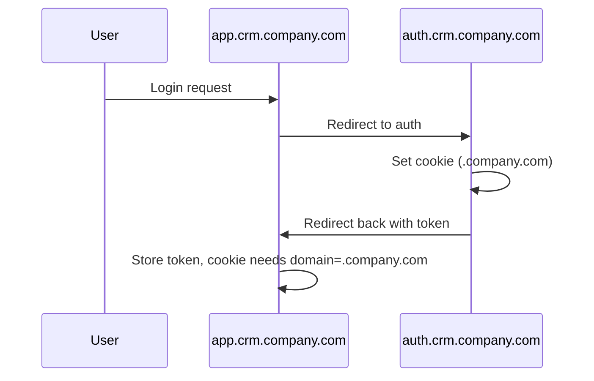
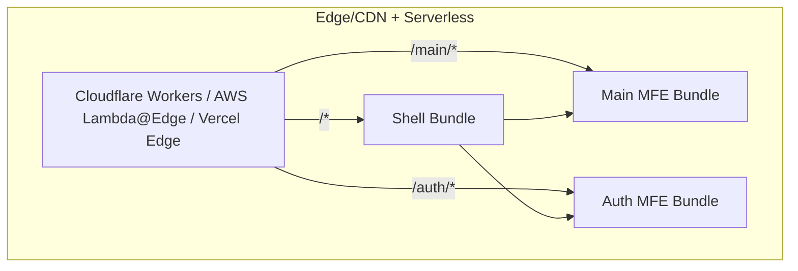
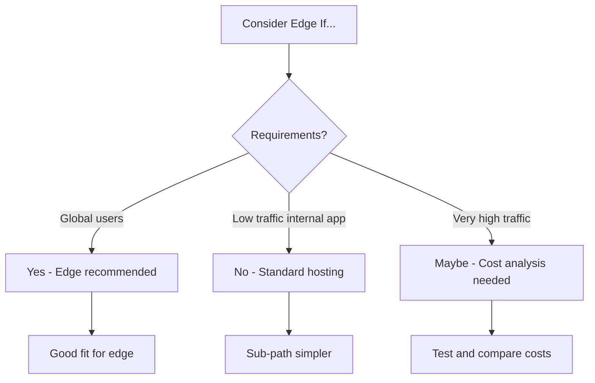
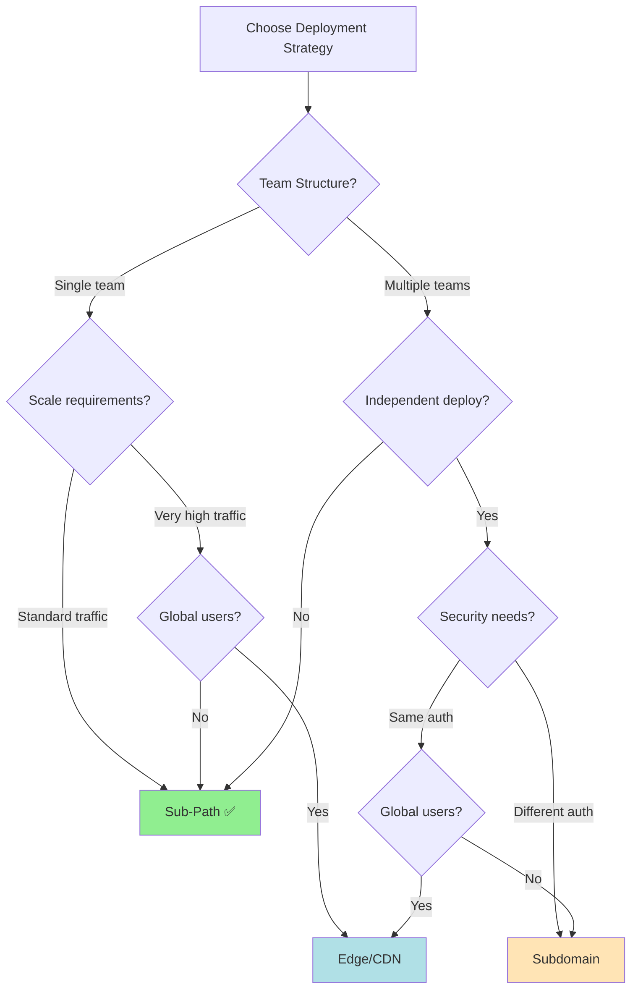
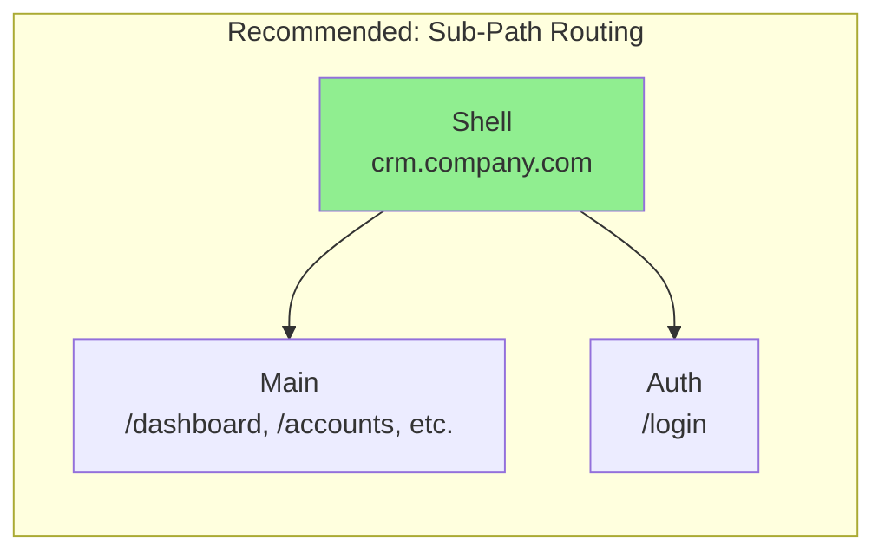

# Deployment Strategy Documentation

## Overview

This document compares two deployment strategies for microfrontend architectures and provides recommendations for this CRM project.

---

## Strategy 1: Sub-Path Routing (Recommended)

All microfrontends hosted under a single domain with URL paths.

```
https://crm.company.com/          -> Shell (or redirects to app)
https://crm.company.com/login      -> Auth MFE
https://crm.company.com/dashboard  -> Main MFE
https://crm.company.com/accounts    -> Main MFE
https://crm.company.com/settings   -> Main MFE
```

### Architecture



### Pros

| Benefit | Description |
|---------|-------------|
| **SEO Friendly** | Single domain, better for search engines |
| **Cookie Sharing** | Cookies work naturally across all paths |
| **SSL Certificate** | One certificate needed |
| **Simpler DNS** | Single A/CNAME record |
| **User Experience** | Users feel like one unified application |
| **CORS Simplified** | Same-origin policy applies naturally |

### Cons

| Drawback | Description |
|----------|-------------|
| **Single Point of Failure** | Shell downtime affects all routes |
| **Scaling Complexity** | All apps must scale together |
| **Shared Base Path** | Can't independently deploy apps |

---

## Strategy 2: Subdomain-Based

Each microfrontend hosted on its own subdomain.

```
https://app.crm.company.com/       -> Shell / Main MFE
https://auth.crm.company.com/login -> Auth MFE
https://accounts.crm.company.com/  -> (future: accounts MFE)
https://crm.company.com/            -> redirects to app.crm.company.com
```

### Architecture



### Pros

| Benefit | Description |
|---------|-------------|
| **Independent Deployment** | Each MFE can be deployed separately |
| **Independent Scaling** | Scale each service based on usage |
| **Failure Isolation** | Auth issues don't crash main app |
| **Team Autonomy** | Teams own their subdomains |
| **Different Tech Stacks** | Easy to use different backends per subdomain |

### Cons

| Drawback | Description |
|----------|-------------|
| **Cookie Issues** | Subdomains = different origins, cookie sharing requires domain setting |
| **CORS Complexity** | Cross-origin requests between subdomains |
| **SSL Management** | Wildcard certificate or multiple certs needed |
| **SEO Impact** | Subdomains treated as separate sites |
| **User Confusion** | Multiple URLs can feel disjointed |
| **Shared State Harder** | Auth token sharing requires extra config |

### Additional Complexity



---

## Strategy 3: Edge/CDN-Based Routing (Advanced)

All microfrontends deployed to CDN/Edge with routing handled at the edge level.

```
https://crm.company.com/          -> Edge serves shell
https://crm.company.com/_next/...  -> Main MFE assets (from edge)
https://crm.company.com/auth/...   -> Auth MFE assets (from edge)
```

### Architecture



### Pros

| Benefit | Description |
|---------|-------------|
| **Global Performance** | Edge servers serve assets from nearest location |
| **Auto-Scaling** | Serverless handles any load automatically |
| **Low Latency** | Users get assets from nearby edge nodes |
| **Cost Efficient** | Pay only for actual requests |
| **Zero Infrastructure** | No servers to manage |

### Cons

| Drawback | Description |
|----------|-------------|
| **Complex Setup** | Requires edge function configuration |
| **Module Federation Challenges** | Remote loading may need custom edge config |
| **Debugging Difficulty** | Harder to trace issues across edge layers |
| **Vendor Lock-in** | Tied to specific edge platform (Cloudflare, Vercel, etc.) |
| **Cold Starts** | Initial requests may be slower |

###适合场景



---

## Three Strategy Comparison

## Three Strategy Comparison

| Criteria | Sub-Path Routing | Subdomain-Based | Edge/CDN-Based |
|----------|------------------|-----------------|----------------|
| **Setup Complexity** | Low | Medium | High |
| **Deployment Independence** | Low | High | High |
| **Cookie/Auth Handling** | Easy | Complex | Complex |
| **SSL Certificates** | 1 | 1 (wildcard) or multiple | 1 |
| **SEO** | Good | Fragmented | Good |
| **User Perception** | Single app | Multiple apps | Single app |
| **Scaling** | Coupled | Decoupled | Auto (serverless) |
| **Failure Isolation** | None | Partial | Partial |
| **Shared State** | Simple | Requires extra config | Requires extra config |
| **Performance** | Standard | Standard | Global (low latency) |
| **Infrastructure** | Simple servers | Container/VMs | Serverless/Edge |
| **Cost** | Fixed | Variable | Pay-per-use |

---

## Decision Flowchart



---

## Recommendation for This CRM

### ✅ Recommended: Sub-Path Routing

**Rationale:**

1. **Current Architecture** - Shell already handles routing; modules load via Federation
2. **Team Size** - Single team developing the CRM; no need for independent deployment
3. **User Experience** - Unified domain feels more professional for internal business app
4. **Simplest Implementation** - No extra config for cookies, CORS, or SSL
5. **Maintenance** - One deployment pipeline, one domain to manage

### When to Switch to Subdomains

Consider subdomain-based deployment if:

- **Separate teams** need independent release cycles (e.g., Finance team owns their own MFE)
- **Different security requirements** (e.g., admin panel on separate subdomain with different auth)
- **Very different tech stacks** (e.g., main app in React, analytics in Vue)
- **Scaling differences** (e.g., auth service has completely different load patterns)

---

## When to Use Each Strategy

### Sub-Path Routing - Best For

- Internal business applications
- Single team development
-中小型项目
- Teams new to microfrontends
- When UX consistency is priority

**Examples**: Internal tools, dashboards, admin panels, CRMs

### Subdomain-Based - Best For

- Large enterprises with multiple product teams
- Different security/compliance requirements
- Teams that need independent release schedules
- Product suites (e.g., separate apps for sales, marketing, support)

**Examples**: Enterprise suites (Salesforce, Atlassian), multi-tenant SaaS

### Edge/CDN-Based - Best For

- Global applications with users worldwide
- High traffic applications
- Teams wanting zero infrastructure management
- When performance is critical

**Examples**: Consumer-facing apps, media platforms, e-commerce

---

## Implementation Guide

### Current Setup (Already Configured)

```json
// mfe.config.json
{
  "modules": [
    { "name": "shell", "host": "https://crm.company.com" },
    { "name": "main", "port": 3001 },
    { "name": "auth", "port": 3002 }
  ]
}
```

### Deployment Configuration (Example)

```yaml
# docker-compose.yml (or cloud config)
services:
  shell:
    image: crm-shell:latest
    ports:
      - "80:80"
    environment:
      - MAIN_remote=http://main:3001/remoteEntry.js
      - AUTH_remote=http://auth:3002/remoteEntry.js

  main:
    image: crm-main:latest
    ports:
      - "3001:80"

  auth:
    image: crm-auth:latest
    ports:
      - "3002:80"
```

### Nginx Configuration (Sub-Path)

```nginx
server {
    listen 80;
    server_name crm.company.com;

    # Shell serves all routes
    location / {
        proxy_pass http://shell:80;
    }

    # Module Federation remotes (optional external access)
    location /remoteEntry.js {
        proxy_pass http://main:80/remoteEntry.js;
    }
}
```

---

## Summary

| Aspect | Decision |
|--------|----------|
| **Strategy** | Sub-Path Routing |
| **Domain** | `crm.company.com` |
| **Auth URL** | `crm.company.com/login` |
| **App URL** | `crm.company.com/*` |
| **Shell** | Main entry point |
| **Scaling** | Horizontal (all services together) |
| **Infrastructure** | Containerized / VMs |

### Strategy at a Glance



**Keep it simple** - Sub-path routing matches the current architecture and provides the best experience for a business CRM application with a single team.

For future scaling needs, you can evolve to:
1. **Subdomain** if multiple teams need independence
2. **Edge/CDN** if global performance becomes critical