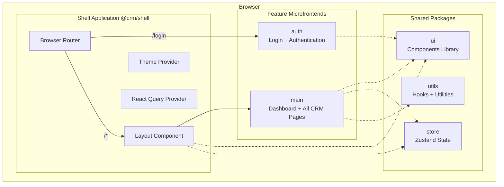
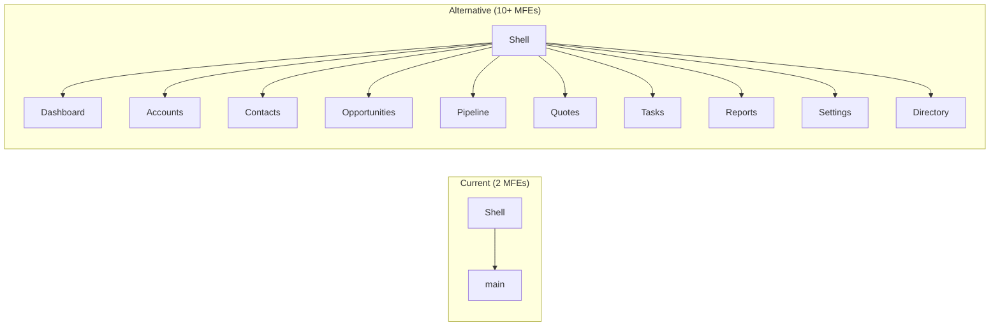
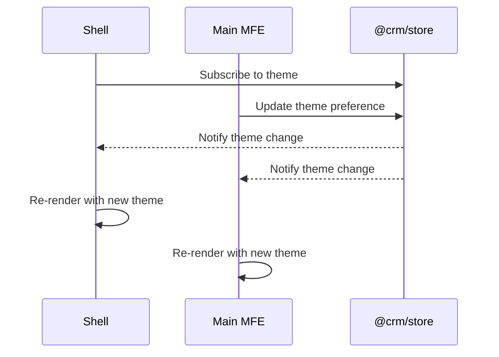
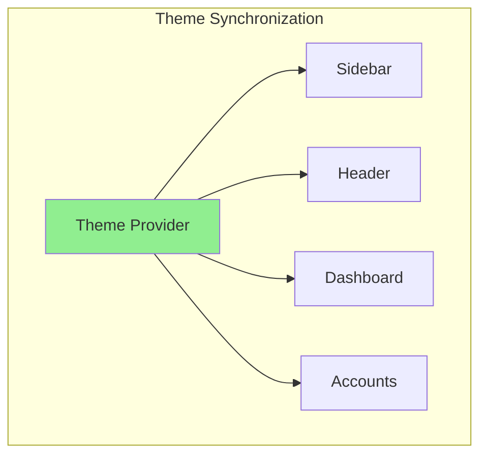
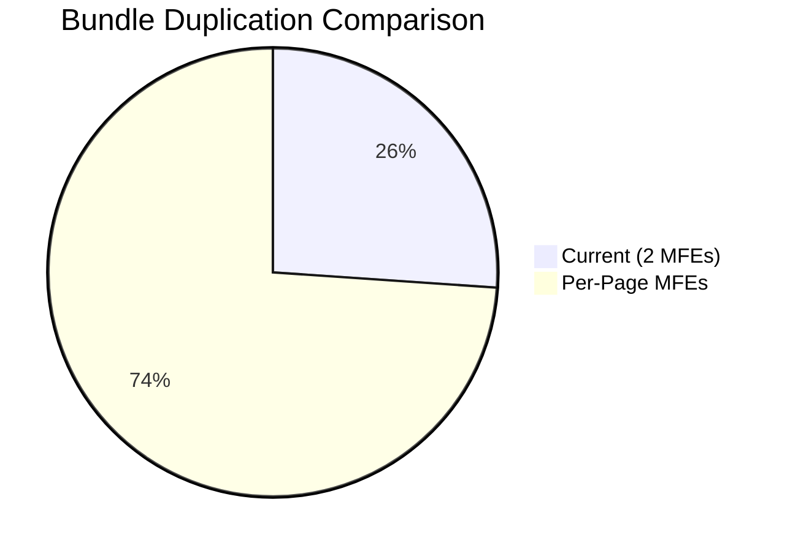
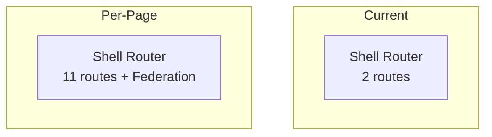

# Microfrontend Architecture Documentation

## Current Architecture: Module Federation with Shell + Features

This document describes the microfrontend architecture implemented in this CRM project and explains why this approach is preferable to having separate microfrontends for each page.

---

## Architecture Overview



---

## Architecture Components

### 1. Shell Application (`@crm/shell`)
- **Purpose**: Container application that orchestrates all microfrontends
- **Responsibilities**:
  - Browser routing and URL management
  - Global layout (sidebar, header)
  - Theme provider and styling
  - Shared state management via `@crm/store`
  - React Query configuration
  - Loading states and error boundaries

### 2. Feature Microfrontends

| App | Port | Exposes | Routes |
|-----|------|---------|--------|
| `main` | 3001 | `./App` | `/dashboard`, `/accounts`, `/contacts`, `/opportunities`, `/pipeline`, `/quotes`, `/tasks`, `/reports`, `/settings`, `/directory` |
| `auth` | 3002 | `./App` | `/login` |

### 3. Shared Packages

| Package | Purpose |
|---------|---------|
| `@crm/ui` | Reusable UI components (Button, Card, Sidebar, Header, Charts) |
| `@crm/store` | Global state (theme, sidebar, notifications) via Zustand |
| `@crm/utils` | Custom hooks (useDebounce, useLocalStorage, useFetch) and formatters |

---

## Why This Architecture > Separate Microfrontends Per Page

### 1. Reduced Complexity



| Aspect | Current Architecture | Per-Page MFEs |
|--------|---------------------|---------------|
| Total MFEs | 2 (shell + features) | 11+ |
| Build pipelines | 2 | 11+ |
| Deployment targets | 2 | 11+ |
| Shared state complexity | Low | High |
| Bundle sharing | Simple | Complex |

### 2. Shared State Made Easy



With per-page microfrontends, each needs its own store instance or complex state synchronization.

### 3. Consistent User Experience



- Single theme provider in shell
- All features inherit consistent styling
- Zero configuration needed per-page

### 4. Faster Development

| Benefit | Explanation |
|---------|-------------|
| Shared components | UI library from `@crm/ui` used by all pages |
| Single deploy for pages | Adding a page = adding route in main MFE |
| Shared dependencies | React, React Router, QueryClient shared once |
| Simpler CI/CD | 2 pipelines vs 11+ |

### 5. Resource Efficiency



- **Current**: React loaded once, shared via Module Federation
- **Per-Page**: Each MFE likely bundles its own React = 10x duplication

### 6. Routing Simplicity



- Shell handles routing to feature MFE
- Feature MFE handles internal page routing
- Clean separation of concerns

---

## When to Split Further

Consider adding new microfrontends when:

1. **Different teams** own different business domains
2. **Different deployment cycles** are needed
3. **Completely different tech stacks** required
4. **Isolated security** requirements (e.g., admin panel)

Example triggers:
- Finance team wants to deploy independently from Sales
- Need separate authentication flows
- Analytics dashboard has completely different UI patterns

---

## Configuration

```json
{
  "modules": [
    { "name": "shell", "type": "shell" },
    { "name": "main", "type": "feature", "port": 3001 },
    { "name": "auth", "type": "feature", "port": 3002 }
  ],
  "shared": {
    "ui": true,
    "store": true,
    "utils": true
  }
}
```

---

## Summary

| Criteria | Current (Recommended) | Per-Page MFEs |
|----------|----------------------|---------------|
| Complexity | Low | High |
| Development Speed | Fast | Slow |
| Shared State | Simple | Complex |
| Bundle Size | Optimized | Duplicated |
| Deployment | 2 targets | 11+ targets |
| Team Scalability | Good | Better (but overkill for this app) |

**Recommendation**: Keep current architecture. Split into more MFEs only when team size or deployment needs justify the complexity.